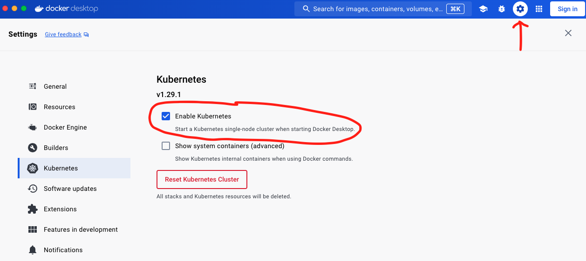
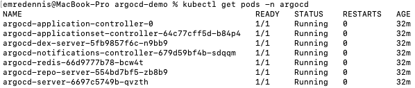
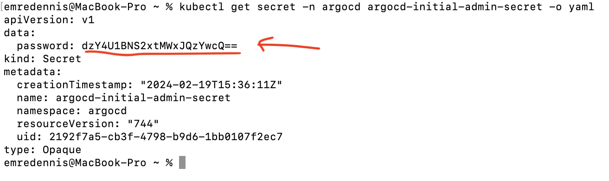
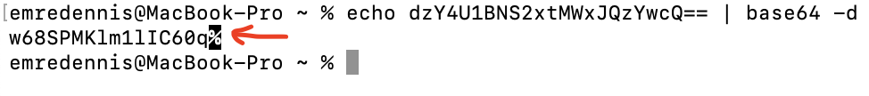
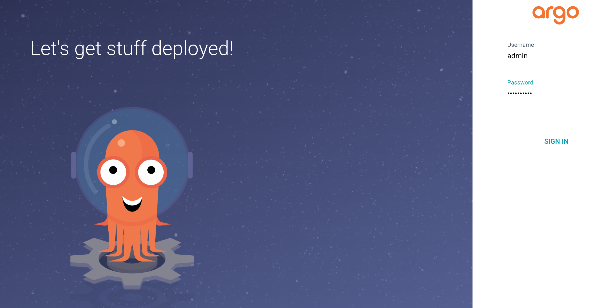
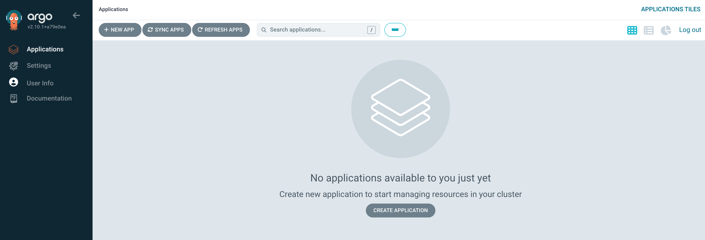

### What is ArgoCD?


Argo CD is a declarative continuous delivery tool for Kubernetes. It can be used as a standalone tool or as a part of your CI/CD workflow to deliver needed resources to your clusters.

In order to manage infrastructure and application configurations aligned with GitOps, your Git repository must be the single source of truth. The desired state of your system should be versioned, expressed declaratively, and pulled automatically. This is where Argo CD comes in.

### How to setup ArgoCD on Mac M3?

1. Install Docker Desktop for Apple Silicon from [here](https://docs.docker.com/desktop/install/mac-install/).
2. Run Docker Desktop, click on the "Settings" button on top right and enable Kubernetes as depicted in the image below:

    
    <br />
    <br />

3. Then enter the commands below in your terminal for Non High Availability (Non HA) setup:

    ```
    minikube start

    kubectl create ns argocd

    kubectl apply -n argocd https://raw.githubusercontent.com/argoproj/argo-cd/stable/manifests/install.yaml

    kubectl get pods -n argocd

    ```
    <br />

    The result of the commands should look like:

    
    <br />
    <br />

4. ArgoCD can be used now and one can start deploying applications.

### How to access ArgoCD server?

By default ArgoCD is not exposed (with external endpoint) outside the cluster. Expose it by using:
- <b>LoadBalancer</b>
    - Change the argocd-server service type to LoadBalancer if managed Kubernetes services are used in cloud (AWS, Azure etc.)
- <b>Ingress:</b> Use your preferred ingress controller
    - Create and ingress resource that point into argocd-server service
- <b>Port-forward:</b> it is simply used to access ArgoCD locally on your machine
<br />

### How to access ArgoCD Web UI?

- Port-forwarding will be used to access ArgoCD Web UI locally

    ```
    kubectl port-forward svc/argocd-server -n argocd 8080:443
    ```

- Get the initial admin password by using the command below:

    ```
    kubectl get secret -n argocd argocd-initial-admin-secret -o yaml
    ```
    <br />

    The result of the commands should look like:

    
    <br />
    <br />

    The password is encoded in base64 format. Therefore it is needed to decode it by:

    ```
    echo dzY4U1BNS2xtMWxJQzYwcQ== | base64 -d
    ```
    <br />

    Here is the output:
    <br />

    The result of the commands should look like:

    
    <br />
    <br />
    <b>Pay attention that there is an extra "%" sign at the end.</b> It is added when the encoded text does not include new line character at the end. Therefore the decoded admin password is without the "%" sign which is <b>w68SPMKlm1lIC60q</b>.
    <br />
    <br />

    Now if you open your browser and enter <b>https://localhost:8080/</b>. Just bypass the https warning and go to the web page. It should show the login page of ArgoCD Web UI now. Enter "admin" as username and your decoded password to access the Web UI as shown below:
    <br />
    <br />

    
    <br />
    <br />

    After logging in successfully you should see the homepage of the ArgoCD Web UI as shown below:
    <br />
    <br />

    
    <br />
    <br />


<br /><br /><br />

### Resources
1. https://www.redhat.com/en/topics/devops/what-is-argocd
2. https://www.udemy.com/course/argo-cd-essential-guide-for-end-users-with-practice/